Django Recipe App Markdown Reforma
User:**   
Exported:** 10/11/2025 8:43:49  
Link:** [https://gemini.google.com/app/c2c8fefbf294b589?utm_source=app_launcher&utm_medium=owned&utm_campaign=base_all](https://gemini.google.com/app/c2c8fefbf294b589?utm_source=app_launcher&utm_medium=owned&utm_campaign=base_all
 
Building a Vegan Recipe Website with Django
===========================================

This guide walks you through setting up a Django project for a vegan recipe website, complete with a powerful, structured database model, admin setup, and a basic homepage.

This tutorial assumes you are on macOS and using `zsh` and `homebrew`.

**_Section_** `1` Setting Up Your Development Environment
-------------------------------------------
-----

First, let's get your local environment and dependencies installed.

### 1.1 Install Python

We'll use `homebrew` to install the latest version of Python 3.

```bash
brew install python
```

Verify the installation:

```bash
python3 --version
```

### 1.2 Create and Activate a Virtual Environment

It's crucial to use a virtual environment to isolate your project's dependencies.

```bash
# 1. Create a project directory and navigate into it
mkdir vegan-recipe-project
cd vegan-recipe-project

# 2. Create a virtual environment named '.venv'
python3 -m venv .venv

# 3. Activate the virtual environment (for zsh)
source .venv/bin/activate
```

Your terminal prompt should now change to show `(.venv)`, indicating the environment is active.

### 1.3 Install Dependencies

We'll use a `requirements.txt` file to manage our dependencies. Start by creating the file `requirements.txt` (see the generated file) and then install from it.

```bash
# Install dependencies from our requirements file
pip install -r requirements.txt
```

_**Section**_ `2` Starting Your Django Project
--------------------------------
----

With our dependencies installed, we can create the Django project and our first app.

### 2.1 Create the Django Project

This command creates the project structure in the _current directory_ (note the `.` at the end).

```bash
django-admin startproject vegan_recipes .
```

### 2.2 Create the `recipes` App

This app will hold all the models, views, and templates related to our recipes.

```bash
python manage.py startapp recipes
```

Your directory should now look something like this:

```mermaid
graph TD
    Root[VeganRecipeApp/]
    
    Root --> Venv[.venv/]
    Root --> Manage[manage.py]
    Root --> Templates[templates/]
    Root --> GitIgnore[.gitignore]
    Root --> ProjectConfig[VeganRecipeApp/]
    Root --> AppDir[goodTastesLike2/]
    
    ProjectConfig --> Settings[settings.py]
    ProjectConfig --> Urls[urls.py]
    ProjectConfig --> Wsgi[wsgi.py]
    ProjectConfig --> Asgi[asgi.py]
    ProjectConfig --> Init1[__init__.py]
    
    AppDir --> Migrations[migrations/]
    AppDir --> Models[models.py]
    AppDir --> Views[views.py]
    AppDir --> Admin[admin.py]
    AppDir --> Apps[apps.py]
    AppDir --> Tests[tests.py]
    AppDir --> Init2[__init__.py]
    
    %% Color coding
    classDef appDir fill:#6ba3ff,stroke:#2d5f9f,color:#000
    classDef configFile fill:#90ee90,stroke:#2d8f2d,color:#000
    classDef templateDir fill:#ffe680,stroke:#cc9900,color:#000
    classDef venvDir fill:#dda0dd,stroke:#8b008b,color:#000
    classDef migrationDir fill:#d3d3d3,stroke:#808080,color:#000
    
    class Venv venvDir
    class Templates templateDir
    class ProjectConfig,AppDir appDir
    class Settings,Urls,Wsgi,Asgi,Manage,Models,Views,Admin,Apps,Tests,GitIgnore configFile
    class Migrations migrationDir
```



**Color Legend**:
- 🔵 **App/Module directories** (blue): Django apps and project config
- 🟢 **Python/config files** (green): All and config files `.py`
- 🟡 **Templates directory** (yellow): Frontend content
- 🟣 **Virtual environment** (purple): Dependencies
- ⚪ **Migrations** (gray): Database migrations


**_Section_** `3` Setting up Version Control with Git
-------------------------------------------------
------------------------------------------------
It's always a good idea to use version control from the start.

### 3.1 Initialize Repository

```bash
git init
```

### 3.2 Create `.gitignore`

A `.gitignore` file (see the generated file) tells Git to ignore files and folders we don't want to track, like our virtual environment or temporary files.

### 3.3 Make Your First Commit

```bash
git add .
git commit -m "Initial project setup with Django"
```

**_Section_** `4` Defining Your Models
------------------------
----
This is the most critical part. We will use the provided `recipe_schema.json` to create a robust set of models in `recipes/models.py`. This structure is far superior to storing ingredients or instructions in a simple `TextField`.

Open `recipes/models.py` and replace its contents with the code from the generated `recipes/models.py` file. This will create four models: `Tag`, `Recipe`, `Instruction`, and `Ingredient`.

### 4.1 Create Database Migrations

After defining your models, you must tell Django how to translate them into database tables.

```bash
python manage.py makemigrations
```

### 4.2 Run the Migrations

This command applies the changes to your database (which will be a `db.sqlite3` file by default).

```bash
python manage.py migrate
```

**_Section_** `5` Activating the Admin Site
-----------------------------
----
Django's built-in admin site is one of its best features. Let's set it up to manage our new models.

### 5.1 Configure `settings.py`

First, we need to tell Django about our `recipes` app and configure paths for media files (like recipe images

Open `vegan_recipes/settings.py` and add `recipes` to your `INSTALLED_APPS`. Then, add the `MEDIA_URL` and `MEDIA_ROOT` settings. See the generated `vegan_recipes/settings.py` file for the exact code to add.

### 5.2 Create a Superuser

You need an admin account to log in.

```bashpython manage.py createsuperuser
```

Follow the prompts to set a username, email, and password.

### 5.3 Configure `admin.py`

To make the admin site useful, we'll register our models. Open `recipes/admin.py` and replace its contents with the code from the generated `recipes/admin.py` file. This code uses `inlines` to allow you to add/edit ingredients and instructions directly on the same page as the recipe.

### 5.4 Run the Development Server

Let's check out the min site.

```bash
    python manage.py runserver
```

Open your browser and go to `http://127.0.0.1:8000/admin/`. Log in with your superuser credentials. You should now see a "Recipes" section where you can add, edit, and delete recipes with all their related ingredients and instructions!

**_Section_** `6` Creating the Homepage View
--------------------------------------------
-------------------------------------------
 
 Now let's create a public-facing page to display our recipes.
 
### 6.1 Create the View

A view is a Python function that handles a web request and returns a response. Open `recipes/views.py` and add the `home` view from the generated `recipes/views.py` file. This view fetches all `Recipe` objects from the database.

### 6.2 Configure URLs
 
 We need to map a URL to our new view.
 
 1.  **Create `recipes/urls.py`**: Create a new file `recipes/urls.py` and add the code from the generated file. This maps the app's root URL (`''`) to the `home` view.
     
 2.  **Include App URLs in Project**: Now, open `vegan_recipes/urls.py` and tell the main project about your app's URLs. Replace the contents of this file with the code from the generated `vegan_recipes/urls.py`. This file also includes the necessary setup to serve media files (images) during development.
     
 
 ### 6.3 Create the Template
 
 Finally, we need an HTML file to render the data.
 
 1.  Create the directory structure:
     
     ```bash
     mkdir -p recipes/templates/recipes
     ```
     
 2.  Create the `home.html` file inside that new directory:
     
     ```bash
     touch recipes/templates/recipes/home.html
     ```
     
 3.  Open `recipes/templates/recipes/home.html` and add the code from the generated HTML file. This template loops through each recipe and displays its details, including the structured ingredients and instructions.
     
 
 ### 6.4 View Your Homepage!
 
 With the server still running (`python manage.py runserver`), open your browser to `http://127.0.0.1:8000/`. You should see a list of your recipes! (It will be empty until you add some via the admin site).
 
 **_Section_** `7` Next Steps
 ----------------------------
--------
 
 You now have a solid foundation! Here's what you can do next:
 
 *   **Add Recipes**: Go to the admin site and add a few recipes with images to see your homepage populate.
     
 *   **Styling**: Add CSS to make your website look good. You can create a `static` directory (`recipes/static/recipes/style.css`) and link it in your `home.html` template.
     
 *   **Detail Page**: Create a new view and template to show a single recipe on its own page when you click it.
     
 *   **User Authentication**: Allow users to create accounts, save favorite recipes, or submit their own.
     
 *   **Recipe Generator**: The original idea for an interactive assistant is complex. You could start with a simple "random recipe" button and build from there. **Recipe Schema** - Nov 3, 2:01 PM
 
 * **Git Ignore** - Nov 3, 2:01 PM

```gitignore

# Virtual Environment
# ==================
 
 .venv/ 
 venv/ 
 ENV/
 .env/
 .DS\_Store
 .idea/
 .pycharm_helpers/
 .vscode/
 .idea/
 .idea/workspace.xml
 .idea/dictionaries/
 .idea/libraries/
 .idea/misc.xml
 .idea/vcs.xml
 .idea/vmoptions
 .idea/workspace.xml

# Python
# ======
 
 **pycache**/
 \*.pyc 
 \*.pyo
 \*.pyd
 
# Django
# ======
 
 \*.log 
 db.sqlite3 
 media/
 
# OS
# ==
 
 .DS\_Store Thumbs.db
```


## Bonus Section!!

---
Here is the `recipes/admin.py` file, formatted as `README.md`.

```python   

    from django.contrib import admin
    from .models import Recipe, Tag, Instruction, Ingredient
    
    # These "Inline" classes allow us to edit Ingredients and Instructions
    # directly on the Recipe admin page. It's much more user-friendly.
    
    class IngredientInline(admin.TabularInline):
        model = Ingredient
        extra = 1  # Show 1 extra empty form by default
        fields = ('group', 'name', 'amount', 'units', 'notes')
    
    class InstructionInline(admin.StackedInline):
        model = Instruction
        extra = 1 # Show 1 extra empty form by default
        fields = ('step_number', 'description')
        ordering = ('step_number',)
    
    @admin.register(Recipe)
    class RecipeAdmin(admin.ModelAdmin):
        list_display = ('name', 'author', 'prep_time', 'cook_time', 'servings', 'updated_at')
        list_filter = ('author', 'tags')
        search_fields = ('name', 'description')
        
        # Add the inlines to the Recipe admin page
        inlines = [IngredientInline, InstructionInline]
        
        # Use a filter for the ManyToManyField
        filter_horizontal = ('tags',)
        
        # Auto-populate author field if not set
        def save_model(self, request, obj, form, change):
            if not obj.author:
                obj.author = request.user
            super().save_model(request, obj, form, change)
    
    @admin.register(Tag)
    class TagAdmin(admin.ModelAdmin):
        list_display = ('name',)
        search_fields = ('name',)
    
    # We don't need to register Ingredient and Instruction separately,
    # as they are now handled "inline" with the Recipe.
```
### LICENCE: MIT 


---
Powered by [Gemini Exporter](https://www.geminiexporter.com)-